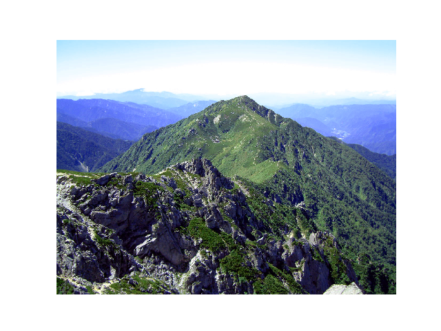

---
author: microsoft
title: 'ONNX Runtime for Keras'
description: 'The following demonstrates how to compute the predictions of a pretrained deep learning model obtained from keras with onnxruntime. The conversion requires keras, tensorflow, onnxmltools but then only onnxruntime is required to compute the predictions.'
ms.date: 2018-12-04
---    
    


# ONNX Runtime for Keras


The following demonstrates how to compute the predictions of a pretrained deep learning model obtained from [keras](https://keras.io/) with *onnxruntime*. The conversion requires [keras](https://keras.io/), [tensorflow](https://www.tensorflow.org/), [onnxmltools](https://pypi.org/project/onnxmltools/) but then only *onnxruntime* is required to compute the predictions.

```python
import os
if not os.path.exists('dense121.onnx'):
    from keras.applications.densenet import DenseNet121
    model = DenseNet121(include_top=True, weights='imagenet')

    from onnxmltools import convert_keras
    onx = convert_keras(model, 'dense121.onnx')

    from onnxmltools.utils import save_model
    save_model(onx, "dense121.onnx")
```


Let’s load an image (source: wikipedia).

```python
from keras.preprocessing.image import array_to_img, img_to_array, load_img
img = load_img('Sannosawa1.jpg')
ximg = img_to_array(img)

import matplotlib.pyplot as plt
plt.imshow(ximg / 255)
plt.axis('off')
```




Let’s load the model with onnxruntime.

```python
import onnxruntime as rt

sess = rt.InferenceSession('dense121.onnx')

print("The model expects input shape:", sess.get_inputs()[0].shape)
print("image shape:", ximg.shape)
```


Out:

```text
The model expects input shape: [1, 224, 224, 3]
image shape: (960, 1280, 3)
```


Let’s resize the image.

```python
from skimage.transform import resize
import numpy

ximg224 = resize(ximg / 255, (224, 224, 3), anti_aliasing=True)
ximg = ximg224[numpy.newaxis, :, :, :]
ximg = ximg.astype(numpy.float32)

print("new shape:", ximg.shape)
```


Out:

```text
new shape: (1, 224, 224, 3)
```


Let’s compute the output.

```python
input_name = sess.get_inputs()[0].name
res = sess.run(None, {input_name: ximg})
prob = res[0]
print(prob.ravel()[:10])  # Too big to be displayed.
```


Out:

```text
[2.1612292e-05 1.1138393e-06 2.1360959e-06 6.0211228e-06 6.5446616e-06
 1.0469350e-06 2.2719589e-06 6.1393899e-07 1.0240102e-06 4.2285183e-06]
```


Let’s get more comprehensive results.

```python
from keras.applications.densenet import decode_predictions
decoded = decode_predictions(prob)

import pandas
df = pandas.DataFrame(decoded[0], columns=["class_id", "name", "P"])
print(df)
```


Out:

```text
class_id           name         P
0  n09468604         valley  0.687382
1  n09193705            alp  0.253061
2  n09246464          cliff  0.012631
3  n09399592     promontory  0.012037
4  n03792972  mountain_tent  0.007539
```


**Total running time of the script:** ( 1 minutes  30.655 seconds)
