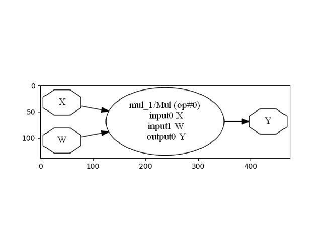

---
author: microsoft
title: 'Draw a pipeline'
description: 'There is no other way to look into one model stored in ONNX format than looking into its node with onnx. This example demonstrates how to draw a model and to retrieve it in json format.'
ms.date: 2018-12-04
---    
    


# Draw a pipeline


There is no other way to look into one model stored in ONNX format than looking into its node with *onnx*. This example demonstrates how to draw a model and to retrieve it in *json* format.

* [Retrieve a model in JSON format](#retrieve-a-model-in-json-format)
* [Draw a model with ONNX](#draw-a-model-with-onnx)


## Retrieve a model in JSON format


That’s the most simple way.

```python
from onnxruntime.datasets import get_example
example1 = get_example("mul_1.pb")

import onnx
model = onnx.load(example1)  # model is a ModelProto protobuf message

print(model)
```


Out:

```text
producer_name: "chenta"
graph {
  node {
    input: "X"
    input: "W"
    output: "Y"
    name: "mul_1"
    op_type: "Mul"
  }
  name: "mul test"
  initializer {
    dims: 3
    dims: 2
    data_type: FLOAT
    float_data: 1.0
    float_data: 2.0
    float_data: 3.0
    float_data: 4.0
    float_data: 5.0
    float_data: 6.0
    name: "W"
  }
  input {
    name: "X"
    type {
      tensor_type {
        elem_type: FLOAT
        shape {
          dim {
            dim_value: 3
          }
          dim {
            dim_value: 2
          }
        }
      }
    }
  }
  output {
    name: "Y"
    type {
      tensor_type {
        elem_type: FLOAT
        shape {
          dim {
            dim_value: 3
          }
          dim {
            dim_value: 2
          }
        }
      }
    }
  }
}
opset_import {
  domain: ""
  version: 7
}
```


## Draw a model with ONNX


We use [net_drawer.py](https://github.com/onnx/onnx/blob/master/onnx/tools/net_drawer.py) included in *onnx* package. We use *onnx* to load the model in a different way than before.

```python
from onnx import ModelProto
model = ModelProto()
with open(example1, 'rb') as fid:
    content = fid.read()
    model.ParseFromString(content)
```


We convert it into a graph.

```python
from onnx.tools.net_drawer import GetPydotGraph, GetOpNodeProducer
pydot_graph = GetPydotGraph(model.graph, name=model.graph.name, rankdir="LR",
                            node_producer=GetOpNodeProducer("docstring"))
pydot_graph.write_dot("graph.dot")
```


Then into an image

```python
import os
os.system('dot -O -Tpng graph.dot')
```


Which we display…

```python
import matplotlib.pyplot as plt
image = plt.imread("graph.dot.png")
plt.imshow(image)
```




**Total running time of the script:** ( 0 minutes  0.411 seconds)
