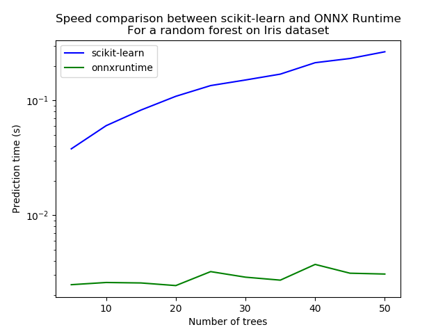

---
author: microsoft
title: 'Train, convert and predict with ONNX Runtime'
description: 'This example demonstrates an end to end scenario starting with the training of a machine learned model to its use in its converted from.'
ms.date: 2018-12-04
---    
    


# Train, convert and predict with ONNX Runtime


This example demonstrates an end to end scenario starting with the training of a machine learned model to its use in its converted from.

* [Train a logistic regression](#train-a-logistic-regression)
* [Conversion to ONNX format](#conversion-to-onnx-format)
* [Probabilities](#probabilities)
* [Benchmark with RandomForest](#benchmark-with-randomforest)


## Train a logistic regression


The first step consists in retrieving the iris datset.

```python
from sklearn.datasets import load_iris
iris = load_iris()
X, y = iris.data, iris.target

from sklearn.model_selection import train_test_split
X_train, X_test, y_train, y_test = train_test_split(X, y)
```


Then we fit a model.

```python
from sklearn.linear_model import LogisticRegression
clr = LogisticRegression()
clr.fit(X_train, y_train)
```


We compute the prediction on the test set and we show the confusion matrix.

```python
from sklearn.metrics import confusion_matrix

pred = clr.predict(X_test)
print(confusion_matrix(y_test, pred))
```


Out:

```text
[[17  0  0]
 [ 0  7  4]
 [ 0  0 10]]
```


## Conversion to ONNX format


We use module [onnxmltools](https://github.com/onnx/onnxmltools) to convert the model into ONNX format.

```python
from onnxmltools import convert_sklearn
from onnxmltools.utils import save_model
from onnxmltools.convert.common.data_types import FloatTensorType

initial_type = [('float_input', FloatTensorType([1, 4]))]
onx = convert_sklearn(clr, initial_types=initial_type)
save_model(onx, "logreg_iris.onnx")
```


We load the model with ONNX Runtime and look at its input and output.

```python
import onnxruntime as rt
sess = rt.InferenceSession("logreg_iris.onnx")

print("input name='{}' and shape={}".format(sess.get_inputs()[0].name, sess.get_inputs()[0].shape))
print("output name='{}' and shape={}".format(sess.get_outputs()[0].name, sess.get_outputs()[0].shape))
```


Out:

```text
input name='float_input' and shape=[1, 4]
output name='label' and shape=[1]
```


We compute the predictions.

```python
input_name = sess.get_inputs()[0].name
label_name = sess.get_outputs()[0].name

import numpy
pred_onx = sess.run([label_name], {input_name: X_test.astype(numpy.float32)})[0]
print(confusion_matrix(pred, pred_onx))
```


Out:

```text
[[17  0  0]
 [ 0  7  0]
 [ 0  0 14]]
```


The prediction are perfectly identical.


## Probabilities


Probabilities are needed to compute other relevant metrics such as the ROC Curve. Let’s see how to get them first with scikit-learn.

```python
prob_sklearn = clr.predict_proba(X_test)
print(prob_sklearn[:3])
```


Out:

```text
[[7.40891513e-04 2.98137427e-01 7.01121682e-01]
 [1.67347797e-03 1.51879818e-01 8.46446705e-01]
 [4.62575982e-04 2.56223115e-01 7.43314309e-01]]
```


And then with ONNX Runtime. The probabilies appear to be

```python
prob_name = sess.get_outputs()[1].name
prob_rt = sess.run([prob_name], {input_name: X_test.astype(numpy.float32)})[0]

import pprint
pprint.pprint(prob_rt[0:3])
```


Out:

```python
[{0: 0.0007408456294797361, 1: 0.2981374263763428, 2: 0.7011218070983887},
 {0: 0.0016735013341531157, 1: 0.15187981724739075, 2: 0.846446692943573},
 {0: 0.00046258745715022087, 1: 0.2562231719493866, 2: 0.7433142066001892}]
```


Let’s benchmark.

```python
from timeit import Timer

def speed(inst, number=10, repeat=20):
    timer = Timer(inst, globals=globals())
    raw = numpy.array(timer.repeat(repeat, number=number))
    ave = raw.sum() / len(raw) / number
    mi, ma = raw.min() / number, raw.max() / number
    print("Average %1.3g min=%1.3g max=%1.3g" % (ave, mi, ma))
    return ave

print("Execution time for clr.predict")
speed("clr.predict(X_test)")

print("Execution time for ONNX Runtime")
speed("sess.run([label_name], {input_name: X_test.astype(numpy.float32)})[0]")
```


Out:

```text
Execution time for clr.predict
Average 3.22e-05 min=3.02e-05 max=4.58e-05
Execution time for ONNX Runtime
Average 5.41e-05 min=4.02e-05 max=0.000126
```


Let’s benchmark a scenario similar to what a webservice experiences: the model has to do one prediction at a time as opposed to a batch of prediction.

```python
def loop(X_test, fct, n=None):
    nrow = X_test.shape[0]
    if n is None:
        n = nrow
    for i in range(0, n):
        im = i % nrow
        fct(X_test[im: im+1])

print("Execution time for clr.predict")
speed("loop(X_test, clr.predict, 100)")

def sess_predict(x):
    return sess.run([label_name], {input_name: x.astype(numpy.float32)})[0]

print("Execution time for sess_predict")
speed("loop(X_test, sess_predict, 100)")
```


Out:

```text
Execution time for clr.predict
Average 0.00324 min=0.00297 max=0.00436
Execution time for sess_predict
Average 0.00271 min=0.0024 max=0.00379
```


Let’s do the same for the probabilities.

```python
print("Execution time for predict_proba")
speed("loop(X_test, clr.predict_proba, 100)")

def sess_predict_proba(x):
    return sess.run([prob_name], {input_name: x.astype(numpy.float32)})[0]

print("Execution time for sess_predict_proba")
speed("loop(X_test, sess_predict_proba, 100)")
```


Out:

```text
Execution time for predict_proba
Average 0.00521 min=0.00476 max=0.00592
Execution time for sess_predict_proba
Average 0.0025 min=0.00237 max=0.00266
```


This second comparison is better as ONNX Runtime, in this experience, computes the label and the probabilities in every case.


## Benchmark with RandomForest


We first train and save a model in ONNX format.

```python
from sklearn.ensemble import RandomForestClassifier
rf = RandomForestClassifier()
rf.fit(X_train, y_train)

initial_type = [('float_input', FloatTensorType([1, 4]))]
onx = convert_sklearn(rf, initial_types=initial_type)
save_model(onx, "rf_iris.onnx")
```


We compare.

```python
sess = rt.InferenceSession("rf_iris.onnx")

def sess_predict_proba_rf(x):
    return sess.run([prob_name], {input_name: x.astype(numpy.float32)})[0]

print("Execution time for predict_proba")
speed("loop(X_test, rf.predict_proba, 100)")

print("Execution time for sess_predict_proba")
speed("loop(X_test, sess_predict_proba_rf, 100)")
```


Out:

```text
Execution time for predict_proba
Average 0.0671 min=0.06 max=0.102
Execution time for sess_predict_proba
Average 0.00233 min=0.00223 max=0.00263
```


Let’s see with different number of trees.

```python
measures = []

for n_trees in range(5, 51, 5):
    print(n_trees)
    rf = RandomForestClassifier(n_estimators=n_trees)
    rf.fit(X_train, y_train)
    initial_type = [('float_input', FloatTensorType([1, 4]))]
    onx = convert_sklearn(rf, initial_types=initial_type)
    save_model(onx, "rf_iris_%d.onnx" % n_trees)
    sess = rt.InferenceSession("rf_iris_%d.onnx" % n_trees)
    def sess_predict_proba_loop(x):
        return sess.run([prob_name], {input_name: x.astype(numpy.float32)})[0]
    tsk = speed("loop(X_test, rf.predict_proba, 100)", number=5, repeat=5)
    trt = speed("loop(X_test, sess_predict_proba_loop, 100)", number=5, repeat=5)
    measures.append({'n_trees': n_trees, 'sklearn': tsk, 'rt': trt})

from pandas import DataFrame
df = DataFrame(measures)
ax = df.plot(x="n_trees", y="sklearn", label="scikit-learn", c="blue", logy=True)
df.plot(x="n_trees", y="rt", label="onnxruntime",
                ax=ax, c="green", logy=True)
ax.set_xlabel("Number of trees")
ax.set_ylabel("Prediction time (s)")
ax.set_title("Speed comparison between scikit-learn and ONNX Runtime\nFor a random forest on Iris dataset")
ax.legend()
```




Out:

```text
5
Average 0.0378 min=0.0372 max=0.039
Average 0.00247 min=0.00217 max=0.00337
10
Average 0.0603 min=0.0594 max=0.0619
Average 0.00258 min=0.00233 max=0.00297
15
Average 0.0825 min=0.0811 max=0.0838
Average 0.00256 min=0.00237 max=0.00273
20
Average 0.109 min=0.104 max=0.116
Average 0.00243 min=0.00237 max=0.00251
25
Average 0.135 min=0.126 max=0.151
Average 0.00321 min=0.00241 max=0.00405
30
Average 0.151 min=0.147 max=0.162
Average 0.00287 min=0.00253 max=0.00331
35
Average 0.17 min=0.167 max=0.172
Average 0.00271 min=0.00266 max=0.00276
40
Average 0.214 min=0.201 max=0.24
Average 0.00371 min=0.00328 max=0.00453
45
Average 0.232 min=0.219 max=0.262
Average 0.00311 min=0.00271 max=0.0041
50
Average 0.266 min=0.239 max=0.285
Average 0.00306 min=0.00281 max=0.00326
```


**Total running time of the script:** ( 0 minutes  54.679 seconds)
